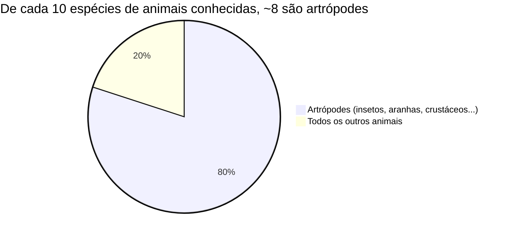
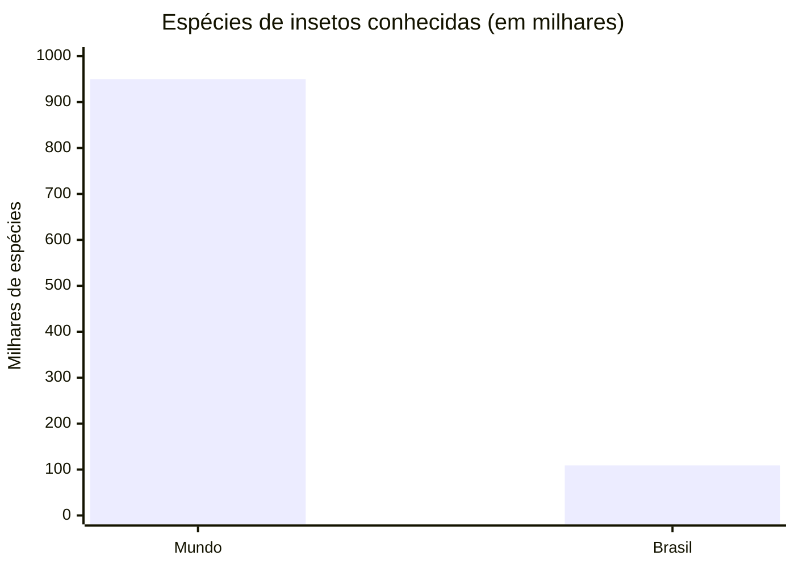
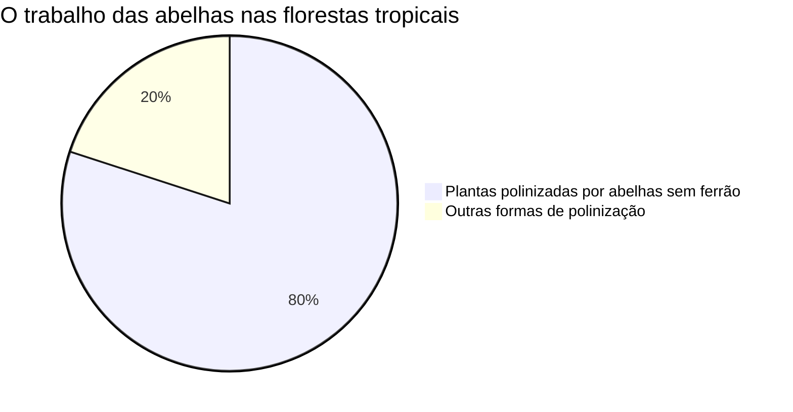

# A influência da biodiversidade brasileira de artrópodes e moluscos na ciência, economia e sustentabilidade mundial

**Disciplina:** Ciências
**Série:** 7º ano
**Aluno(a):** ______________________________
**Professor(a):** ______________________________
**Escola:** ______________________________
**Data:** 2026

---

## Sumário

1. Introdução
2. O que são artrópodes e moluscos?
3. A biodiversidade do Brasil
4. Influência na Ciência
5. Influência na Economia
6. Influência na Sustentabilidade
7. Conclusão
8. Referências

---

## 1. Introdução

O Brasil é o país com a **maior biodiversidade do mundo**, ou seja, é onde existe a maior variedade de seres vivos. Entre todos esses animais, dois grupos se destacam pela quantidade enorme de espécies: os **artrópodes** (como insetos, aranhas, escorpiões e camarões) e os **moluscos** (como caracóis, ostras, mexilhões e polvos).

Esses animais, muitas vezes pequenos, têm uma importância gigante. Eles ajudam a **ciência** a descobrir novos remédios, movimentam a **economia** com a produção de mel e camarão, e mantêm o **equilíbrio da natureza** (sustentabilidade). Neste trabalho vamos ver como a riqueza desses grupos no Brasil ajuda o mundo todo.

---

## 2. O que são artrópodes e moluscos?

Os dois são animais **invertebrados** (não têm ossos, nem coluna vertebral), mas são bem diferentes:

| Característica | Artrópodes | Moluscos |
|---|---|---|
| Corpo | Dividido em partes, com **patas articuladas** | **Mole**, muitas vezes com concha |
| Esqueleto | **Exoesqueleto** (esqueleto por fora) | Concha (em vários deles) |
| Exemplos | Insetos, aranhas, escorpiões, camarões | Caracóis, lesmas, ostras, polvos |
| Onde vivem | Terra, água e ar | Terra e água (muitos no mar) |

**Curiosidade:** os artrópodes são o maior grupo de animais do planeta. De cada 10 espécies de animais que os cientistas conhecem, cerca de **8 são artrópodes**!


*Gráfico 1 — Os artrópodes dominam a vida animal na Terra.*

---

## 3. A biodiversidade do Brasil

O Brasil tem um número impressionante de espécies. Veja alguns números dos artrópodes e moluscos brasileiros:

| Grupo | Espécies (aproximado) |
|---|---|
| Insetos no Brasil | mais de **109.000** |
| Abelhas no Brasil | mais de **2.500** |
| Abelhas sem ferrão no Brasil | mais de **400** |
| Insetos no mundo todo | cerca de **950.000** |

Comparando o Brasil com o mundo, dá para ver como nosso país é rico em insetos:


*Gráfico 2 — O Brasil sozinho tem mais de 1 em cada 10 espécies de insetos do planeta.*

Veja também a quantidade de espécies de abelhas no Brasil:

```text
Espécies de abelhas no Brasil
Total de abelhas   █████████████████████████  ~2.500
Abelhas sem ferrão ████                        ~400
(cada █ ≈ 100 espécies)
```
*Gráfico 3 — As abelhas sem ferrão são típicas do Brasil e muito importantes.*


*Figura 1 — Abelha jataí, uma abelha sem ferrão brasileira. (Fonte: Wikimedia Commons)*

---

## 4. Influência na Ciência

Muitos animais brasileiros ajudam os cientistas a criar **remédios** e **novas tecnologias**. Isso acontece porque o veneno e o corpo desses animais têm substâncias especiais.

| Animal | Como ajuda a ciência |
|---|---|
| Caracol-cone (molusco) | Seu veneno virou um **remédio para dor** muito forte |
| Escorpião amarelo (artrópode) | Veneno estudado para fazer **remédios** e antídotos |
| Borboleta morfo-azul (artrópode) | Suas asas inspiram **tintas e telas** que não desbotam (biomimética) |
| Aranhas (artrópodes) | A seda da teia é pesquisada por ser **leve e resistente** |

**Destaque — o caracol que virou remédio:** o veneno do caracol-cone marinho (*Conus*) deu origem a um analgésico chamado **ziconotida**, que é cerca de **1.000 vezes mais potente que a morfina** e não causa vício. Isso mostra como um molusco pode salvar pessoas com dores muito fortes.


*Figura 2 — Caracol-cone (Conus). Seu veneno é a base de um remédio para dor. (Fonte: Wikimedia Commons)*


*Figura 3 — Escorpião amarelo: seu veneno é estudado para criar remédios e antídotos. (Fonte: Wikimedia Commons)*

---

## 5. Influência na Economia

Esses animais também geram **dinheiro e empregos**. Veja as principais atividades:

| Atividade | O que é | Importância |
|---|---|---|
| Meliponicultura | Criação de abelhas **sem ferrão** | Mel, pólen e polinização das plantações |
| Apicultura | Criação de abelhas **com ferrão** | Produção de mel e cera |
| Carcinicultura | Criação de **camarões** | Alimento e exportação |
| Ostreicultura | Criação de **ostras** | Alimento, muito em Santa Catarina |
| Mitilicultura | Criação de **mexilhões** | Alimento barato e saudável |

Alguns números da economia no Brasil:

| Produto | Quanto produz / quanto rende |
|---|---|
| Camarão (2024) | cerca de **R$ 6,3 bilhões** por ano |
| Ostras (Santa Catarina) | cerca de **1,1 milhão de dúzias** por ano |
| Mexilhões (Santa Catarina) | cerca de **11.000 toneladas** por ano |

> A criação de camarão se concentra no **Nordeste**, que produz quase **toda** a produção do país. Já as ostras e mexilhões são típicos de **Santa Catarina**, no Sul.

---

## 6. Influência na Sustentabilidade

Sustentabilidade significa **cuidar da natureza** para que ela continue funcionando bem. Os artrópodes e moluscos fazem trabalhos essenciais, de graça, todos os dias:

| Animal | Serviço para a natureza |
|---|---|
| Abelhas | **Polinização**: levam o pólen e ajudam as plantas a dar frutos |
| Besouros e formigas | **Decomposição**: reciclam folhas e restos de animais |
| Ostras e mexilhões | **Filtram a água**, deixando-a mais limpa |
| Insetos em geral | Servem de **alimento** para pássaros, peixes e outros animais |
| Borboletas e alguns moluscos | São **bioindicadores**: avisam quando o ambiente está poluído |

**Você sabia?** Estima-se que cerca de **80% das plantas das florestas tropicais** sejam polinizadas por abelhas sem ferrão. Sem esses animais, faltaria comida para muitos seres vivos — inclusive para nós.


*Gráfico 4 — As abelhas são fundamentais para a vida das florestas.*

---

## 7. Conclusão

Os artrópodes e os moluscos do Brasil são pequenos, mas têm uma influência **enorme** no mundo. Na **ciência**, ajudam a criar remédios, como o analgésico feito do veneno do caracol-cone. Na **economia**, geram bilhões de reais com mel, camarão, ostras e mexilhões. E na **sustentabilidade**, fazem a polinização, limpam a água e mantêm o equilíbrio da natureza.

Por tudo isso, é muito importante **proteger a biodiversidade brasileira**. Preservar florestas, rios e mares é proteger animais que ajudam o planeta inteiro. Cuidar deles é cuidar do nosso futuro.

---

## 8. Referências

- EMBRAPA. *Pesquisadores descrevem 60 novas espécies de insetos no Brasil*. Disponível em: https://www.embrapa.br/busca-de-noticias/-/noticia/99271105/pesquisadores-descrevem-60-novas-especies-de-insetos-no-brasil-e-destacam-papel-na-conservacao. Acesso em: 2026.
- TODA MATÉRIA. *Insetos: características, classificação e exemplos*. Disponível em: https://www.todamateria.com.br/insetos/. Acesso em: 2026.
- SEBRAE. *Meliponicultura: conheça mais sobre as abelhas sem ferrão*. Disponível em: https://sebrae.com.br/sites/PortalSebrae/artigos/meliponicultura-conheca-mais-sobre-as-abelhas-sem-ferrao,ed1bcc6150e47810VgnVCM1000001b00320aRCRD. Acesso em: 2026.
- A.B.E.L.H.A. *Abelhas sem ferrão*. Disponível em: https://abelha.org.br/abelhas-sem-ferrao/. Acesso em: 2026.
- CRQ-SP. *Veneno de caracol marinho vira remédio contra dor*. Disponível em: https://crqsp.org.br/veneno-de-caracol-marinho-vira-remedio-contra-dor/. Acesso em: 2026.
- JORNAL CIÊNCIA. *Caracol marinho mais venenoso do mundo tem analgésico 1000x mais potente que a morfina*. Disponível em: https://www.jornalciencia.com/caracol-marinho-mais-venenoso-do-mundo-tem-analgesico-1000x-mais-potente-que-morfina/. Acesso em: 2026.
- BROTO NOTÍCIAS. *Carcinicultura no Brasil: produção, desafios e tendências*. Disponível em: https://noticias.broto.com.br/pecuaria/aquicultura/carcinicultura-no-brasil-producao-desafios-e-tendencias-da-criacao-de-camarao/. Acesso em: 2026.
- CANAL RURAL. *Cultivo de camarão impulsiona economia do Nordeste*. Disponível em: https://www.canalrural.com.br/pecuaria/dos-viveiros-para-a-mesa-cultivo-de-camarao-impulsiona-economia-do-nordeste/. Acesso em: 2026.
- WIKIMEDIA COMMONS. *Imagens de domínio público / Creative Commons* (abelha jataí, caracol-cone, escorpião). Disponível em: https://commons.wikimedia.org. Acesso em: 2026.
